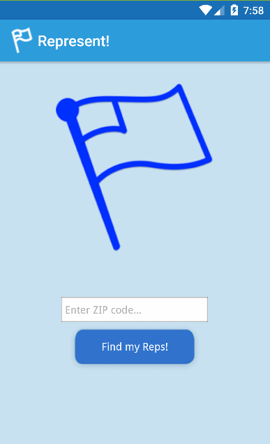

# PROG 02: Represent!

Represent informs users of the various representatives and senators in their area or across the nation! The application connects with an Android Wear device and allows immediate results from the mobile to the watch. Tap once on the wear to show the detailed information of the current delegate. Tape twice to see how the county voted in the 2012 election. Shaking the watch will result in results of random locations.

## Authors

Connie Truong ([ctruong1337@berkeley.edu](mailto:ctruong1337@berkeley.edu))

## Demo Video

See Functionality of Represent (https://youtu.be/8_miOqHNXmA)

## Screenshots

## Acknowledgments

* Credits to ([Jason McReynolds](http://jasonmcreynolds.com/?p=388)) for creating the shake listener!
